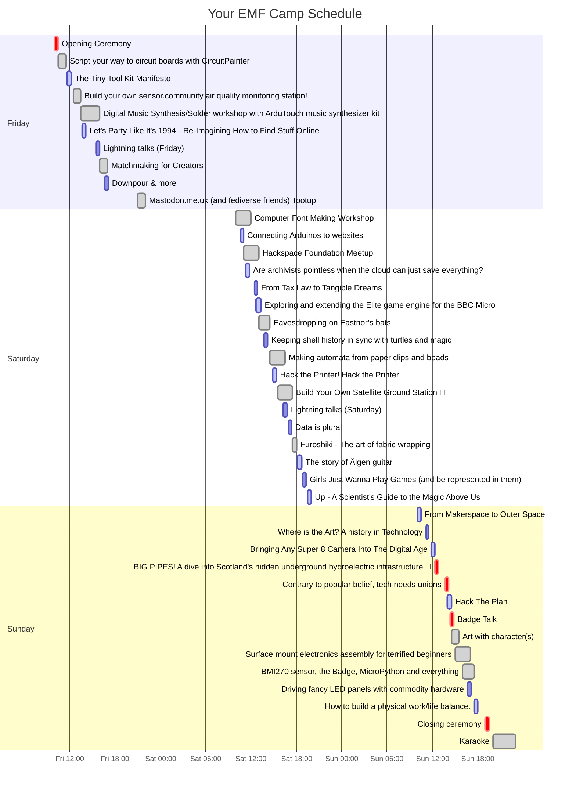

# EMF Camp Schedule Viewer
Once you have got your link to your favourite talks/workshops from [EMF 2024 Line-up](https://www.emfcamp.org/schedule/2024), clone/fork this repo, modify the code, and run it to generate your personal gantt chart. Github uses [Mermaid.js](http://mermaid.js.org/syntax/gantt.html) to render the code block, so you can visualise the output by committing the repo back to github.

